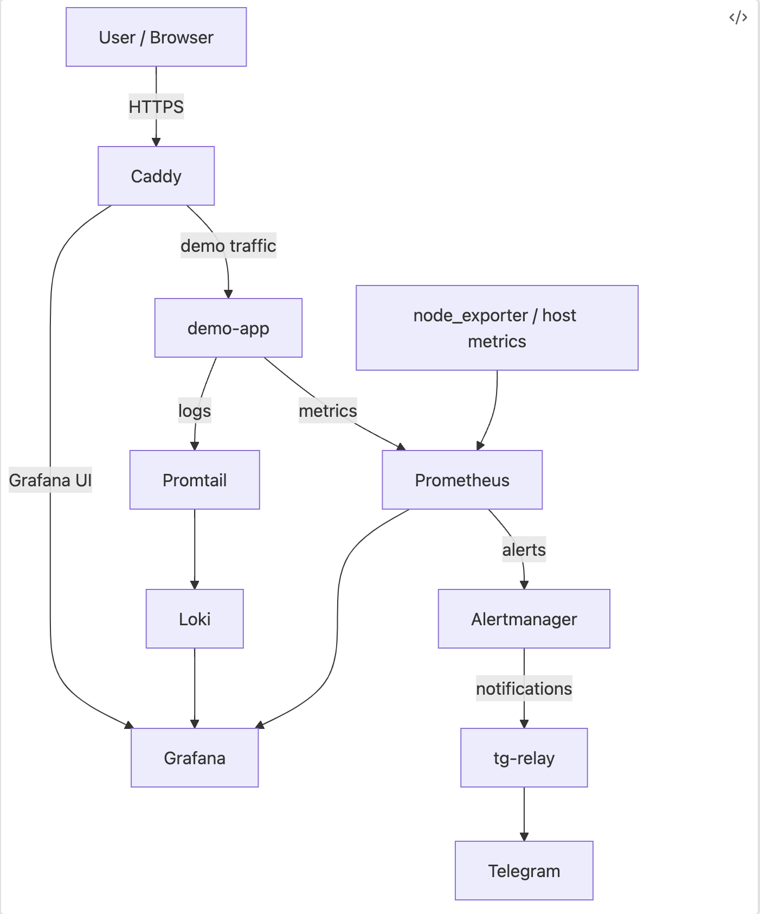

# Observability Stack


Production-style monitoring stack built with **Prometheus, Loki and Grafana**.

This repository demonstrates a complete observability pipeline including:

- metrics collection
- log aggregation
- alerting
- dashboards
- Telegram alert notifications
- operational runbooks
- reverse proxy ingress
- basic SSH hardening

The stack runs entirely with **Docker Compose**.

---

# Live demo

A public demo instance of the application is available:

https://demo.142.93.143.228.nip.io/

The demo exposes endpoints used to trigger monitoring scenarios and alerts.

---

# Tech stack

- **Docker Compose** — service orchestration
- **Prometheus** — metrics collection and alert evaluation
- **Alertmanager** — alert routing and grouping
- **Loki** — log storage
- **Promtail** — log shipping
- **Grafana** — dashboards and visualization
- **Caddy** — reverse proxy and HTTPS ingress
- **Fail2ban** — SSH protection
- **Python / FastAPI** — demo application
- **Telegram** — alert notifications via `tg-relay`
- **Linux / Ubuntu** — deployment environment


---

# Architecture

Monitoring architecture including metrics, logs and alerting pipeline.



---

# Dashboard preview

Example Grafana dashboard showing host metrics collected by node_exporter.


Metrics shown:
- CPU usage
- memory utilization
- network traffic
- disk usage

---

# Features

- Monitoring stack deployed with Docker Compose
- Prometheus alert rules for host and application health
- Loki + Promtail log pipeline
- Grafana dashboards for metrics and logs
- Telegram alert delivery through relay service
- Caddy reverse proxy for external access
- Fail2ban integration for SSH protection
- Demo endpoints for alert testing
- Runbook for incident investigation

---

# Quick start

Start the monitoring stack:

```
docker compose up -d
```

Verify containers:

```
docker ps
```

---

# Monitoring health check

A helper script is available to verify the monitoring stack.

Run:

```
monitor
```

The script checks:

- container status
- Prometheus readiness
- Alertmanager readiness
- Loki readiness
- Prometheus targets
- active alerts
- demo-app health endpoint
- recent Promtail errors

---

# Operations

### Check container status

```
docker compose ps
```

### Inspect logs

```
docker compose logs --tail=100
```

### Check Prometheus alerts

```
curl http://127.0.0.1:9090/api/v1/alerts | jq
```

### Check Prometheus targets

```
curl http://127.0.0.1:9090/api/v1/targets | jq
```

### Check Loki health

```
curl http://127.0.0.1:3100/ready
```

### Check Alertmanager health

```
curl http://127.0.0.1:9093/-/ready
```

---

# Services

| Service | URL |
|--------|------|
| Grafana | http://localhost:3000 |
| Prometheus | http://localhost:9090 |
| Alertmanager | http://localhost:9093 |

If deployed with **Caddy**, Grafana may be exposed via HTTPS.

---

# Repository structure

```
.
├── docker-compose.yml
├── Makefile
├── .gitignore
├── .yamllint.yml
├── README.md
├── docs/
│   ├── runbook.md
│   └── dashboard.png
├── scripts/
│   └── monitor
├── prometheus/
│   ├── prometheus.yml
│   └── alerts.yml
├── alertmanager/
│   └── alertmanager.yml
├── loki/
│   └── loki.yml
├── promtail/
│   └── promtail.yml
├── grafana/
├── data/
├── loki-data/
├── alertmanager-data/
├── promtail-positions/
├── caddy/
├── fail2ban/
├── demo-app/
└── tg-relay/
```

---

# Alerts

Implemented alert rules include:

- NodeExporterDown
- HostLowDiskSpace
- HostMemoryPressure
- HostHighCpuLoad
- HostRebootDetected
- DemoAppDown
- DemoAppHigh5xxRate
- DemoAppHighP95Latency
- DemoAppHighInflight

Alert investigation steps are documented in:

```
docs/runbook.md
```

---

# Demo and testing

Trigger a **5xx error**:

```
https://demo.142.93.143.228.nip.io/error?code=503
```

Trigger a **slow request**:

```
https://demo.142.93.143.228.nip.io/slow
```

These endpoints allow testing the full monitoring pipeline:

1. trigger endpoint
2. observe metrics in Prometheus
3. verify alert firing
4. confirm Telegram notification

---

# Logs

Application logs are collected via **Promtail** and stored in **Loki**.

Logs can be explored in Grafana using LogQL queries.

Example:

```
{service_name="demo-app"} | json | status >= 500
```

---

# Security

Sensitive data is not tracked in the repository.

Ignored items include:

- runtime storage directories
- environment secrets
- TLS keys
- SSH keys

See `.gitignore` for details.

---

# Runbook

Operational troubleshooting documentation:

```
docs/runbook.md
```

---

# Skills demonstrated

- observability stack design
- Prometheus alerting rules
- centralized logging with Loki
- incident runbook design
- containerized infrastructure
- reverse proxy configuration
- CI validation for infrastructure configs

---

# CI

Configuration quality is validated through GitHub Actions.

Workflow:

https://github.com/Elyablack/monitoring-stack/blob/main/.github/workflows/validate-configs.yml

The workflow verifies:

- YAML syntax (`yamllint`)
- Prometheus configuration (`promtool check config`)
- Prometheus alert rules (`promtool check rules`)
- Alertmanager configuration (`amtool check-config`)

These checks ensure that monitoring configuration changes cannot be merged if they break the stack.

---

# Future improvements

### Public observability dashboards

Expose a dedicated Grafana instance for public viewing of selected monitoring dashboards.

---

### Infrastructure automation

Introduce **Ansible** for automated deployment and configuration of the monitoring stack.

---

### Distributed tracing

Extend observability with **Grafana Tempo** for distributed tracing.

This will enable correlation between:

- metrics (Prometheus)
- logs (Loki)
- traces (Tempo)

---

### Observability-driven operations

Extend the stack beyond monitoring to support operational workflows:

- automated remediation scripts
- incident response tooling
- alert-driven operational actions

---

# License

MIT
