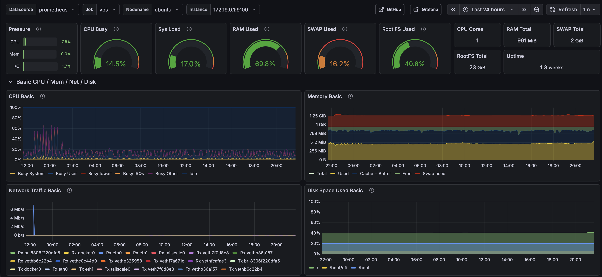

# Observability Stack


Production-style **observability and monitoring stack** built with **Prometheus, Loki, and Grafana**.

This repository demonstrates a complete observability pipeline including:

- metrics collection
- log aggregation
- alerting
- dashboards
- Telegram alert notifications
- operational runbooks
- reverse proxy ingress
- basic host & edge hardening
- CI validation and automated dependency updates

The stack runs entirely with **Docker Compose**.

---

## Live demo

Public demo instance:

- https://demo.142.93.143.228.nip.io/

The demo exposes endpoints used to trigger monitoring scenarios and alerts.

---

## Tech stack

- **Docker Compose** — service orchestration
- **Prometheus** — metrics collection and alert evaluation
- **Alertmanager** — alert routing and grouping
- **Loki** — log storage
- **Promtail** — log shipping
- **Grafana** — dashboards and visualization
- **Caddy** — reverse proxy and HTTPS ingress
- **Fail2ban** — SSH + HTTP abuse protection
- **Python / FastAPI** — demo application
- **Telegram** — alert notifications via `tg-relay`
- **Linux / Ubuntu** — deployment environment

---

## Architecture

Monitoring architecture including metrics, logs and alerting pipeline.

```
User → Caddy → demo-app

metrics pipeline
demo-app → Prometheus → Alertmanager → tg-relay → Telegram

logs pipeline
demo-app → Promtail → Loki → Grafana
```

Full architecture diagram: 

```
docs/images/architecture.png
```

---

## Dashboard preview

Example Grafana dashboard showing host metrics collected by node_exporter.



Metrics shown:
- CPU usage
- memory utilization
- network traffic
- disk usage

---

## Features

- Monitoring stack deployed with Docker Compose
- Prometheus alert rules for host and application health
- Loki + Promtail log pipeline
- Grafana dashboards for metrics and logs
- Telegram alert delivery through relay service
- Caddy reverse proxy for external access
- Fail2ban integration (SSH + HTTP abuse patterns)
- Demo endpoints for alert testing
- Runbook for incident investigation

---

## Quick start

Start the monitoring stack:

```
docker compose up -d
docker ps
```

---

## Monitoring health check

A helper script is available to verify the monitoring stack.

Run:

```
monitor
```

Checks performed:

- running Docker containers
- Prometheus readiness
- Alertmanager readiness
- Loki readiness
- demo-app health endpoint
- tg-relay container health
- Prometheus scrape targets status
- unhealthy scrape targets
- currently firing alerts
- pending alerts

Location:

```
scripts/monitoring-health.sh
```

---

## Operations

### Check container status

```
docker compose ps
```

### Inspect logs

```
docker compose logs --tail=100
```

### Check Prometheus alerts

```
curl http://127.0.0.1:9090/api/v1/alerts | jq
```

### Check Prometheus targets

```
curl http://127.0.0.1:9090/api/v1/targets | jq
```

### Check Loki health

```
curl http://127.0.0.1:3100/ready
```

### Check Alertmanager health

```
curl http://127.0.0.1:9093/-/ready
```

---

## Services

| Service | URL |
|--------|------|
| Grafana | http://localhost:3000 |
| Prometheus | http://localhost:9090 |
| Alertmanager | http://localhost:9093 |

If deployed with **Caddy**, Grafana may be exposed via HTTPS.

---

## Repository structure

```
.
├── docker-compose.yml
├── Makefile
├── renovate.json
├── .gitignore
├── .yamllint.yml
├── README.md
├── docs/
│   ├── runbook.md
│   ├── architecture.png
│   └── dashboard.png
├── scripts/
│   └── monitor
├── prometheus/
│   ├── prometheus.yml
│   └── alerts.yml
├── alertmanager/
│   └── alertmanager.yml
├── loki/
│   └── loki.yml
├── promtail/
│   └── promtail.yml
├── grafana/
├── data/
├── loki-data/
├── alertmanager-data/
├── promtail-positions/
├── caddy/
├── fail2ban/
├── demo-app/
└── tg-relay/
```

---

## Alerts

Implemented alert rules include:

- NodeExporterDown
- HostLowDiskSpace
- HostMemoryPressure
- HostHighCpuLoad
- HostRebootDetected
- DemoAppDown
- DemoAppHigh5xxRate
- DemoAppHighP95Latency
- DemoAppHighInflight

Alert investigation steps are documented in:

```
docs/runbook.md
```

---

## Demo and testing

Trigger a **5xx error**:

```
https://demo.142.93.143.228.nip.io/error?code=503
```

Trigger a **slow request**:

```
https://demo.142.93.143.228.nip.io/slow
```

These endpoints allow testing the full monitoring pipeline:

1. trigger endpoint
2. observe metrics in Prometheus
3. verify alert firing
4. confirm Telegram notification

---

## Logs

Application logs are collected via **Promtail** and stored in **Loki**.

Example LogQL:

```
{service_name="demo-app"} | json | status >= 500
```

---

## Security

### Pinned images (reproducible deployments)

Core infrastructure images are pinned by digest in docker-compose.yml to avoid unexpected changes from floating tags like latest.

### Container hardening

Services use container hardening defaults where applicable:

- no-new-privileges    
- cap_drop: ALL
- PID limits

### Secrets hygiene

Sensitive data is not tracked in the repository.

Ignored items include:

- runtime storage directories    
- environment secrets
- TLS keys
- SSH keys

See .gitignore for details.

---

## CI/CD

The repository uses GitHub Actions for CI and deployments.

### Infrastructure validation

Configuration changes are validated automatically before merging.

- YAML lint
- Prometheus config validation (promtool)
- Prometheus rules validation (promtool)
- Alertmanager config validation (amtool)

Workflow:
```
https://github.com/Elyablack/monitoring-stack/blob/main/.github/workflows/validate-configs.yml
```

### Application build & deploy

Application services are built and deployed automatically:

- demo-app    
- tg-relay

Flow:

1. Build image    
2. Push image to GHCR
3. Deploy updated container on VPS (SHA tag)
4. Health wait
5. Automatic rollback to stable on failure
6. Telegram deployment notification

### Release tags

Creating a tag vX.Y.Z publishes:

- ghcr.io/elyablack/demo-app:X.Y.Z    
- ghcr.io/elyablack/demo-app:stable
- ghcr.io/elyablack/demo-app:latest

(and same for tg-relay)

---

## Dependency automation

- **Dependabot** updates **GitHub Actions** weekly.
- **Renovate** updates **Docker images** (compose/Dockerfiles) weekly, with auto-merge for patch/digest updates.

---

## Future improvements

1. Infrastructure automation with Ansible (one-command provision + deploy)
2. Distributed tracing with Grafana Tempo (metrics/logs/traces correlation)
3. Alert-driven automation (self-healing workflows)

---

# License

MIT
