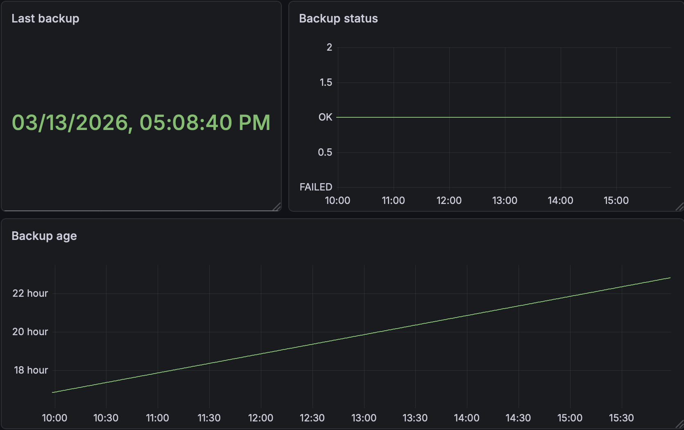

# Backup alerts

## Dashboard

The alerts described in this runbook correspond to the **Backup monitoring dashboard**.



This dashboard provides visibility into the health of the backup pipeline.

The dashboard includes the following panels:

- **Last backup** — timestamp of the most recent successful backup
- **Backup status** — success/failure state of the last backup
- **Backup age** — time elapsed since the last successful backup

These panels allow operators to quickly verify whether backups are running correctly and how long ago the last successful backup occurred.

---

## Backup monitoring workflow

The backup pipeline consists of several stages:

1. backup archive creation on the VPS
2. archive download to the Mac host
3. checksum generation and verification
4. offsite replication to the `admin` and `lab` nodes
5. publishing backup success metric to the node exporter textfile collector

The alert **BackupMissing** fires when the metric `backup_last_success_unixtime` indicates that the last successful backup is older than the expected threshold.

---

## Contents

- [BackupMissing](#backupmissing)

---

## BackupMissing

**Severity:** critical

### Description

The backup pipeline did not complete successfully, or the last successful backup is older than **26 hours**.

Alert source:

- metric: `backup_last_success_unixtime`
- rule: `time() - backup_last_success_unixtime > 93600`

Possible causes:

- scheduled backup job on Mac did not run
- backup creation on VPS failed
- rsync download to Mac failed
- offsite replication to `admin` or `lab` failed
- backup success metric was not written to the node exporter textfile collector

---

### Investigation

### Check backup metric in Prometheus

```bash
curl -s http://127.0.0.1:9090/api/v1/query \
  --data-urlencode 'query=backup_last_success_unixtime'
````

Check whether the metric exists on the VPS node exporter endpoint:

```
curl -s http://127.0.0.1:9100/metrics | grep backup_last_success
```

Check the metric file on VPS:

```
sudo cat /var/lib/node_exporter/textfile_collector/backup.prom
```

Expected output:

```
backup_last_success_unixtime <unix_timestamp>
backup_last_success 1
```

---

### Check scheduled backup execution on Mac

Verify that the launchd job is loaded:

```
launchctl list | grep infra-backup
```

Run the backup pipeline manually:

```
/Users/elvira/infra/scripts/run_backup.sh
```

Inspect logs:

```
tail -n 100 /Users/elvira/infra/backups/backup.log
tail -n 100 /Users/elvira/infra/backups/backup.err.log
```

---

### Check backup creation on VPS

Verify backup files on VPS:

```
ssh vps 'ls -lh /srv/backups'
```

Expected files:

```
vps-backup-YYYY-MM-DD-HHMM.tar.gz
```

If no recent archive exists, run the Ansible backup playbook manually from Mac:

```
cd /Users/elvira/infra
ansible-playbook playbooks/backup_vps.yml
```

---

### Check local backup download on Mac

Verify local backup storage:

```
ls -lh /Users/elvira/infra/backups
```

Expected files:

```
vps-backup-YYYY-MM-DD-HHMM.tar.gz
vps-backup-YYYY-MM-DD-HHMM.tar.gz.sha256
```

If missing, run:

```
rsync -avz vps:/srv/backups/ /Users/elvira/infra/backups/
```

---

### Check offsite replication

Verify backup copies on admin:

```
ssh admin 'ls -lh ~/infra-backups'
```

Verify backup copies on lab:

```
ssh lab 'ls -lh ~/infra-backups'
```

Re-run offsite replication if necessary:

```
/Users/elvira/infra/scripts/offsite_backup.sh
```

---

### Check backup integrity

Verify local checksum:

```
shasum -a 256 -c /Users/elvira/infra/backups/<backup-file>.tar.gz.sha256
```

Test restore safely:

```
/Users/elvira/infra/scripts/restore_vps.sh /Users/elvira/infra/backups/<backup-file>.tar.gz test
```

---

### Recovery

If the backup pipeline failed:

1. run the backup pipeline manually
    
2. confirm a new archive exists on VPS
    
3. confirm the archive exists on Mac
    
4. confirm offsite copies exist on admin and lab
    
5. confirm backup.prom was updated on VPS
    
6. confirm Prometheus now reports a fresh backup_last_success_unixtime

Manual recovery command:

```
/Users/elvira/infra/scripts/run_backup.sh
```

---

### Resolution criteria

The incident is resolved when:

- `backup_last_success_unixtime` exists in Prometheus
- `time() - backup_last_success_unixtime` is below alert threshold
- a recent archive exists on VPS
- a recent archive exists on Mac
- offsite copies exist on admin and lab
- checksum verification succeeds
