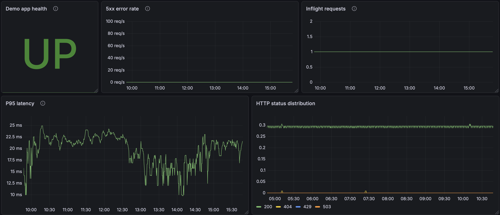

# Demo alerts

## Dashboard

Demo alerts can be observed in the **Application alerts dashboard**.

This dashboard shows the key application signals that change when demo endpoints are triggered.



The dashboard includes panels for:

- demo application health
- HTTP 5xx error rate
- inflight requests
- P95 request latency
- HTTP status distribution

These panels allow operators to observe how the monitoring system reacts when demo alerts are triggered.

---

## Contents

- [DemoAppButtonError503](#demoappbuttonerror503)
- [DemoAppButtonSlow](#demoappbuttonslow)

---

These alerts are intentionally triggered using demo endpoints in the example application.

They are used to test the monitoring pipeline:

- Prometheus metrics
- alert rules
- Alertmanager routing
- Telegram notifications
- runbook procedures

**Note**

Demo alerts are routed to a **blackhole receiver** in Alertmanager.

They do **not generate real operator notifications**.

Monitoring pipeline for demo alerts:

```
demo endpoint
     │
     ▼
Prometheus metrics
     │
     ▼
Alert rule evaluation
     │
     ▼
Alertmanager routing
     │
     ├── production alerts → Telegram
     └── demo alerts → blackhole
```

---

## DemoAppButtonError503

### Description

This endpoint intentionally generates HTTP 503 responses.

Used to trigger:

```
DemoAppHigh5xxRate
```

### Trigger

```
/error?code=503
```

Example:

```
https://demo.142.93.143.228.nip.io/error?code=503
```

### Expected behaviour

1. request returns HTTP 503  
2. metrics increment in Prometheus  
3. alert fires after rule threshold  
4. alert is routed by Alertmanager to the **blackhole receiver**

---

## DemoAppButtonSlow

### Description

This endpoint intentionally creates slow requests.

Used to trigger:

```
DemoAppHighP95Latency
```

### Trigger

```
/slow
```

Example:

```
https://demo.142.93.143.228.nip.io/slow
```

### Expected behaviour

1. request latency increases  
2. latency histogram changes  
3. alert fires after threshold  
4. alert is routed by Alertmanager to the **blackhole receiver**
