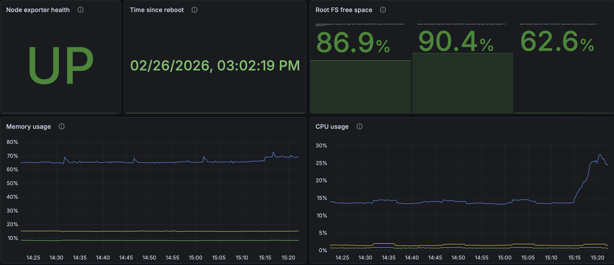

# Host alerts

## Dashboard

The alerts described in this runbook correspond to the **Host alerts dashboard**.

This dashboard provides a **high-level overview of host health** and is intended for quick investigation when a host-related alert fires.



The dashboard includes panels for:

- node exporter health
- root filesystem usage
- memory usage
- CPU usage
- time since reboot

These panels provide the most important host signals needed for rapid triage.

---

## Host monitoring dashboards

Two dashboards are available for host monitoring:

| Dashboard | Purpose |
|------|------|
| **Host alerts** | quick investigation when an alert fires |
| **Node exporter full** | detailed host diagnostics and full host metrics |

The **Node exporter full dashboard** contains the complete set of metrics exported by node_exporter, including:

- CPU metrics
- memory metrics
- filesystem usage
- disk I/O
- network traffic
- system load
- kernel metrics

It is intended for **deep investigation** after an alert has fired.

The dashboard does **not** contain alert rules and is used purely for observability and troubleshooting.

---

## Scope

This runbook covers infrastructure and host-level alerts such as:

- exporter availability
- low disk space
- memory pressure
- high CPU load
- reboot detection

These alerts are primarily investigated through host metrics and system state rather than application logs.

---

## Contents

- [NodeExporterDown](#nodeexporterdown)
- [HostLowDiskSpace](#hostlowdiskspace)
- [HostMemoryPressure](#hostmemorypressure)
- [HostHighCpuLoad](#hosthighcpuload)
- [HostRebootDetected](#hostrebootdetected)

---

## NodeExporterDown

**Severity:** critical

### Description

Prometheus cannot scrape `node_exporter` metrics.

This usually means one of the following:

- host unreachable
- exporter stopped
- network issue
- scrape configuration error
- firewall or connectivity issue between Prometheus and the target

### Investigation

Check connectivity:

```
ping <host>
```

Try SSH:

```
ssh <host>
```

If the host is unreachable check:

- network connectivity
- VPS or VM status
- Tailscale connectivity if used
- recent reboot or infrastructure events

Check exporter endpoint:

```
curl http://<host>:9100/metrics
```

If the exporter endpoint is not reachable:

```
systemctl status node_exporter
```

If exporter runs in a container:

```
docker ps
docker logs <node-exporter>
```

Check Prometheus scrape status:

```
curl http://127.0.0.1:9090/api/v1/targets | jq
```

Or via Prometheus UI:

```
Status → Targets
```

### Resolution

Typical fixes include:

- restore host reachability
- restart node_exporter
- fix binding or firewall rules
- fix Prometheus scrape configuration
- recover the underlying host if it is down

---

## HostLowDiskSpace

**Severity:** critical

### Description

Filesystem free space is **below 10%.**

This alert indicates that the host is approaching a storage exhaustion condition and may soon begin failing writes, logging, or container operations.

### Investigation

Check filesystem usage:

```
df -h
```

Check inode usage:

```
df -i
```

Find large directories:

```
du -sh /* | sort -h
```

Inspect log usage:

```
du -sh /var/log/*
```

Check Docker storage:

```
docker system df
```

Inspect Docker resources:

```
docker images
docker volumes
docker ps -a
```

If backups are stored locally on the host, also check whether backup artifacts are consuming significant space.

### Resolution

Possible cleanup actions:

- remove unused Docker images
- rotate logs
- remove temporary files
- clean package caches
- remove stale artifacts
- remove old backups if retention policy allows it

**Do not** remove:

- database volumes
- active backups
- required application logs
- any file you have not positively identified as safe to remove

### Resolution criteria

The incident is resolved when:

- free space is safely above the alert threshold
- the source of disk growth is understood
- essential services continue operating normally

---

## HostMemoryPressure

**Severity:** warning

### Description

Available system memory is critically low.

This alert indicates memory pressure that may lead to swapping, degraded performance, or OOM kills if the condition continues.

### Investigation

Check memory usage:

```
free -h
```

Find memory-heavy processes:

```
ps aux --sort=-%mem | head
```

Check for OOM events:

```
dmesg | grep -i oom
```

or:

```
journalctl -k | grep -i oom
```

Inspect container memory usage:

```
docker stats
```

Check whether the condition is short-lived or sustained by reviewing dashboard history.

If the affected host is the Mac agent target, also verify whether the separate control-plane and mac remediation flow observed the condition.

### Resolution

Typical fixes include:

- identify and stop runaway processes
- reduce memory-heavy workloads
- restart a wedged service
- investigate container memory use
- add memory or rebalance workload if the condition is structural

### Resolution criteria

The incident is resolved when:

- available memory returns to a safe level
- no active OOM pattern remains
- the heavy consumer is identified or removed

---

## HostHighCpuLoad

**Severity:** warning

### Description

CPU load on the host is unusually high.

This alert indicates sustained CPU pressure rather than a short transient burst.

### Investigation

Check CPU usage:

```
top
```

or:

```
htop
```

Find CPU-heavy processes:

```
ps aux --sort=-%cpu | head
```

Check system load:

```
uptime
```

Inspect container resource usage:

```
docker stats
```

Check whether the CPU pressure correlates with:

- backup execution
- container restart loops
- log bursts
- heavy scraping or scans
- scheduled jobs

### Resolution

Typical fixes include:

- identify the hot process
- stop or reduce noisy workloads
- fix restart loops
- tune scraping or scheduled jobs
- restart a broken service if needed

### Resolution criteria

The incident is resolved when:

- CPU usage returns to a normal range
- load average stabilizes
- the source of sustained CPU pressure is understood

---

## HostRebootDetected

**Severity:** warning

### Description

Prometheus detected a reboot via the metric:

```
node_boot_time_seconds
```

This alert is informational but important because a reboot may explain:

- missing metrics
- short service outages
- container restarts
- changed host state after maintenance or failure recovery

### Investigation

Check uptime:

```
uptime
```

Check reboot history:

```
last reboot
```

Inspect logs from the previous boot:

```
journalctl -b -1
```

Verify that services restarted correctly:

```
docker ps
```

Check for failed units:

```
systemctl --failed
```

Confirm whether the reboot was:

- planned maintenance
- provider event
- kernel update
- crash recovery
- power or infrastructure issue

### Resolution

Usually no direct remediation is required for the reboot alert itself.

The main task is to verify that the host and its services recovered correctly.

Focus on:

- node_exporter health
- container availability
- application reachability
- backup freshness
- alert noise caused by incomplete startup

### Resolution criteria

The alert can be considered handled when:

- the reboot cause is understood or accepted
- the host is reachable
- required services are healthy
- no secondary incident remains active

---

## Notes

Host alerts are best used as the first signal for infrastructure health.

Use the Host alerts dashboard for fast triage, then move to Node exporter full or host-level commands for deeper investigation.
